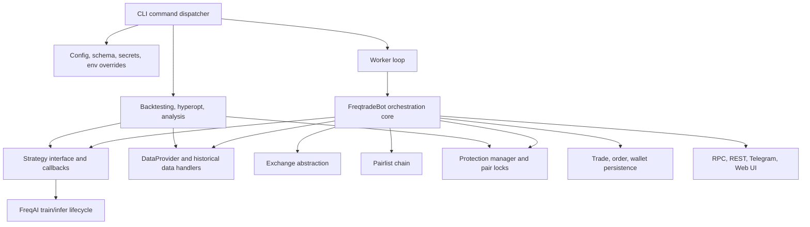

# Freqtrade High-Level Architecture And Pattern Pass

Last updated: 2026-05-14 (America/Denver)

Source repo: `freqtrade/freqtrade`
Local path: `external_repos/freqtrade`
Source branch: `develop`
Source commit: `e00a1fd28c03`
License boundary: GPL-3.0 study-only. Do not copy source into PQTS without an explicit license decision. Any implementation below must be PQTS-native and must preserve `execution.RiskAwareRouter.submit_order()` as the only order-entry path.

## Purpose

This pass looks at Freqtrade at architecture and pattern level before any implementation zoom-in. The goal is to identify reusable ideas that strengthen PQTS as a governed prediction/forecast monetization system, while avoiding direct source reuse and avoiding exchange-side shortcuts.

Primary ledger:

- `docs/assimilation/FREQTRADE_ASSIMILATION_LEDGER.md`
- `docs/assimilation/freqtrade_file_ledger.csv`
- `docs/assimilation/freqtrade_file_ledger.json`

## Architecture Snapshot

Freqtrade is a Python modular trading bot with a broad command surface, a long-running runtime worker, strategy callback interfaces, exchange/data abstractions, backtesting/hyperopt tooling, plugin chains, persistent trade/order models, and operator controls through Telegram, REST, and Web UI.

## Major Components

| Area | Freqtrade Pattern | PQTS Interpretation |
| --- | --- | --- |
| Command surface | One CLI exposes trade, data download, backtest, hyperopt, analysis, plotting, webserver, and utility commands. | PQTS should keep research, validation, paper, and ops commands discoverable from stable scripts/CLI entrypoints. |
| Runtime loop | `Worker` manages state, throttling, reconfiguration, and shutdown; `FreqtradeBot` owns trade lifecycle orchestration. | PQTS already has a composed runtime; borrow the explicit loop-state and reconfiguration mental model, not the order path. |
| Strategy API | `IStrategy` exposes lifecycle, indicator, entry/exit, position adjustment, pricing, stake, leverage, stop, and confirmation callbacks. | PQTS needs a narrower typed strategy contract focused on forecasts, EV, constraints, stage-gate evidence, and risk impact. |
| Data access | `DataProvider` centralizes OHLCV/trade data, analyzed frames, producer data, market metadata, orderbook/ticker access, and cache boundaries. | PQTS should formalize a research/runtime data-provider facade so strategies do not reach into venue adapters directly. |
| Universe selection | Pairlist handlers form an ordered chain of list producers and filters: static, volume, percent change, spread, volatility, delisting, precision, etc. | Strong fit: build a PQTS universe/filter chain for markets/contracts/events before research tournaments and paper campaigns. |
| Protections | Protections return lock objects for global or per-pair stops with duration, side, and reason. Locks are persisted and evaluated in backtests. | Very strong fit: add a typed risk-lock ledger for strategy, market, venue, and event locks, wired to stage gates and router risk checks. |
| Backtesting parity | Backtests share strategy callbacks where possible, include fees, simulate order lifecycle, and document callback-frequency mismatch. | PQTS should keep tightening parity between historical replay, paper, and live-data paper smoke. |
| Bias analysis | Dedicated `lookahead-analysis` and `recursive-analysis` commands probe strategy outputs for future leakage and unstable recursive indicators. | High-value immediate integration: make PQTS-native analyzers for generated strategies and validation payloads. |
| Persistence | Trade/order models, pair locks, custom trade data, wallet history, and query helpers provide operator-visible state. | PQTS already has order truth and ledgers; borrow custom decision metadata and lock-history query patterns. |
| Resolvers | Resolvers load strategies, exchanges, pairlists, protections, hyperopt losses, and FreqAI models from configured paths. | PQTS should prefer explicit registries/manifests over import magic, but resolver-style extension discovery is useful for research plugins. |
| Config validation | JSON schema, config normalization, environment variables, secrets, and deployment templates make runtime behavior explicit. | PQTS can strengthen config schema coverage for research/paper/live ladders and auto-generate operator docs from schemas. |
| Operator surface | RPC manager, REST API, Telegram, and Web UI expose status/control without being strategy code. | PQTS should keep all external controls as intent/proposal surfaces, never direct order-entry surfaces. |
| ML lifecycle | FreqAI separates feature engineering, data kitchen, model drawer, train/inference timers, metadata, and historic predictions. | Useful as a lifecycle pattern only; PQTS should keep model evidence behind OOS/deflated-Sharpe/gate artifacts. |

## Highest-Value Patterns To Assimilate

### 1. Bias And Parity Analysis Commands

Freqtrade has explicit commands for lookahead bias and recursive-indicator drift. PQTS already has purged CV, walk-forward validation, and the real-money ladder, but the system would benefit from separate falsification tools that intentionally try to break a strategy.

PQTS-native target:

- `scripts/run_backtest_bias_analysis.py`
- `scripts/run_recursive_signal_analysis.py`
- Reports under `data/reports/research_bias_analysis_<run_id>/`

Acceptance criteria:

- Compare full-run signals against sliced or delayed recomputations.
- Flag use of future data, unstable startup windows, and indicators that change materially when history length changes.
- Integrate with `scripts/run_real_money_validation.py` as a blocking research gate.

### 2. Universe Selection Chain

Freqtrade's pairlist design is a clean pipeline: one producer creates a tradable list, then filters refine it. PQTS has symbols/markets/contracts across prediction venues and adjacent crypto data; a chain would make selection policy transparent and testable.

PQTS-native target:

- `src/research/universe_filters.py`
- `config/research/universe_filters.yaml`
- Tests proving deterministic filter ordering and reason-coded exclusions.

Candidate filters:

- Venue eligibility
- Liquidity/depth/spread
- Resolution ambiguity
- Market age/delist/expiry
- Volatility and gap risk
- Correlation/concentration
- Data completeness
- Human/regulatory allowlist gates

### 3. Protection Locks As First-Class Risk State

Freqtrade protections convert recent losses, drawdowns, low-profit pairs, and cooldown windows into time-bounded locks. PQTS has kill switches and risk gates, but a unified lock ledger would improve explainability and make "why are we not trading this?" answerable.

PQTS-native target:

- `src/risk/trading_locks.py`
- `src/execution/risk_aware_router.py` lock checks before order creation
- API/readout integration with order-truth and ops-health surfaces

Lock dimensions:

- `scope`: global, venue, market, strategy, symbol, contract, event
- `side`: long, short, both, yes, no
- `reason`: drawdown, slippage, stale data, ambiguity, cooldown, low edge, operator hold
- `until`: timestamp or stage condition
- `evidence`: metric summary and source artifact

### 4. Strategy Lifecycle Contract

Freqtrade's strategy callbacks are extensive. PQTS should not copy that surface wholesale; it should extract a stricter lifecycle for forecast-to-capital decisions.

PQTS-native target:

- Strategy manifest and protocol covering:
  - `prepare_features`
  - `generate_forecast`
  - `estimate_ev`
  - `propose_position`
  - `explain_decision`
  - `on_fill_update`
  - `on_stage_metrics`

Rules:

- Strategy code can propose; router/risk decides.
- No strategy callback can place orders.
- Every proposal produces evidence suitable for promotion gates.

### 5. Data Provider Facade

Freqtrade's `DataProvider` gives strategies a single place to request market data, analyzed dataframes, orderbooks, producer data, and metadata. PQTS has data components, market adapters, live-data resilience, and research lake pieces, but a stricter facade would prevent strategy code from coupling to adapters.

PQTS-native target:

- `src/research/data_provider.py` for research/replay
- `src/modules/data.py` or canonical module facade for runtime
- Adapter access kept behind configured provider methods

Core behavior:

- Return provenance with every dataset.
- Separate historical, live-public, and authenticated data modes.
- Surface stale/unresolved data state explicitly.
- Make cache policy observable in reports.

### 6. Resolver/Registry Extension Model

Freqtrade has resolver classes for strategies, exchanges, protections, pairlists, hyperopt losses, and ML models. PQTS already has module registry and strategy generation. The useful idea is a typed extension manifest with deterministic discovery.

PQTS-native target:

- Extend `src/strategies/plugin_sdk.py` and research strategy manifests.
- Add "loadable but not executable" review states.
- Require declared risk, data, and promotion contracts before a plugin can enter research tournaments.

### 7. Backtest Result Analysis Pack

Freqtrade keeps utilities for backtest result display, analysis, plotting, and rejected-signal inspection. PQTS can use a lighter version that focuses on decision quality, gate failures, and economic realism.

PQTS-native target:

- Extend research artifacts with:
  - rejected candidate reasons
  - skipped/locked market reasons
  - signal-to-fill attribution
  - cost/slippage sensitivity
  - market/regime concentration

### 8. Config Schema And Generated Operator Docs

Freqtrade's config schema and generated command docs make operator behavior discoverable. PQTS has many scripts and configs; schema-backed docs would lower operator error.

PQTS-native target:

- Add schemas for `config/live_data.yaml`, `config/paper.yaml`, research tournament config, and validation ladder config.
- Generate markdown tables for required/optional fields.
- Validate configs before long-running paper or validation jobs.

### 9. Wallet And State Snapshots

Freqtrade records wallets and trading state in a way that supports dry/live reconciliation. PQTS has order ledgers and TCA; wallet/equity snapshots tied to paper/live stages would improve paper-readiness evidence.

PQTS-native target:

- Stage-level wallet/equity snapshots for paper and live-data paper.
- Link snapshots to TCA, slippage, kill-switch state, and promotion gates.

### 10. ML Lifecycle Discipline

FreqAI separates feature creation, data preparation, model metadata, historic predictions, train queues, and inference telemetry. PQTS should not import that stack, but the lifecycle boundaries are useful.

PQTS-native target:

- Model cards tied to research artifacts.
- Train/infer telemetry in strategy reports.
- Feature schema hashes and historic prediction replay checks.
- Model expiration/drift gates before paper promotion.

## Things Not To Assimilate Directly

- Direct exchange order placement paths. PQTS must keep `RiskAwareRouter.submit_order()` as the only order-entry path.
- GPL source code without a license decision.
- CCXT/exchange breadth as a product goal. PQTS is prediction-market-first and forecast-monetization-first.
- Strategy callback freedom that lets strategy code control too much execution behavior.
- Backtest assumptions that all orders fill unless explicitly modeled and labeled.
- FreqAI implementation code. Only lifecycle discipline should be studied.

## Recommended Assimilation Sequence

1. Build PQTS-native lookahead and recursive-signal analyzers.
2. Build a universe/filter-chain contract for research tournaments and paper campaigns.
3. Add a typed risk-lock ledger and expose locks in ops-health/order-truth reports.
4. Define a narrower forecast strategy lifecycle protocol and manifest.
5. Add config schema validation and generated operator docs for validation/paper configs.
6. Extend research reports with rejected-signal, rejected-market, cost-sensitivity, and concentration analysis.
7. Add model lifecycle metadata only after the above falsification gates are in place.

## Immediate Next Implementation Candidates

| Priority | Candidate | Why It Matters | Suggested PQTS Area |
| --- | --- | --- | --- |
| P0 | Lookahead-bias analyzer | Prevents false alpha from future leakage. | `src/research/anti_leakage_validator.py`, new CLI |
| P0 | Recursive-signal stability analyzer | Catches indicators/signals that change when startup history changes. | `src/research/anti_leakage_validator.py`, new CLI |
| P0 | Risk-lock ledger | Makes cooldowns, drawdown locks, venue holds, and operator holds explicit. | `src/risk/`, `src/execution/`, ops reports |
| P1 | Universe filter chain | Gives market selection auditable reason codes. | `src/research/`, `config/research/` |
| P1 | Data provider facade | Keeps strategies away from adapters and preserves provenance. | `src/research/`, `src/modules/data.py` |
| P1 | Strategy lifecycle manifest | Makes strategies easier to review, stage, and promote safely. | `src/research/`, `src/strategies/` |
| P2 | Config schema docs | Reduces operator mistakes in long validation runs. | `config/`, `docs/`, `tools/` |
| P2 | Backtest analysis pack | Improves evidence quality before paper promotion. | `src/research/report_builder.py` |
| P3 | ML lifecycle metadata | Useful after basic falsification gates mature. | `src/research/`, model cards |

## PQTS Fit Summary

The best architectural lesson is that a serious trading system is not just strategies and exchange adapters. It is the control plane around them: data boundaries, selection filters, protection locks, falsification tools, operator surfaces, and persistence. Freqtrade's mature patterns can improve PQTS most if they are converted into PQTS-native gates and evidence artifacts, not copied as execution code.

Near-term focus should be falsification and risk-state explainability:

1. Prove strategies are not leaking future data.
2. Prove signals are stable under realistic startup history.
3. Prove market selection and locks are explicit and replayable.
4. Only then broaden strategy/plugin ergonomics.
